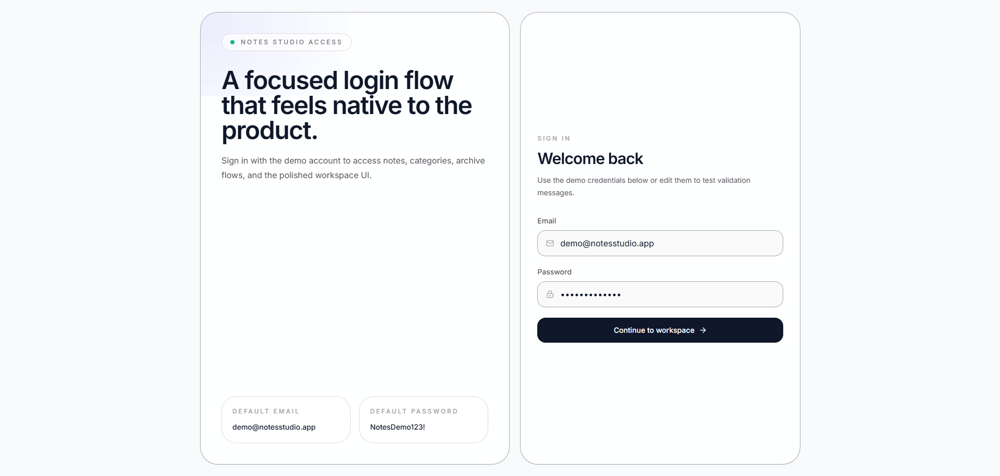
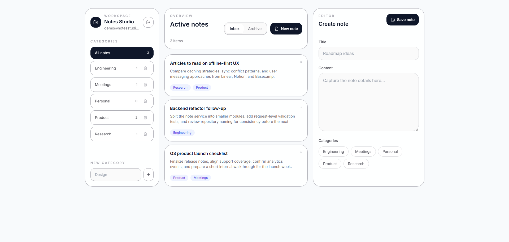

# Notes Studio - Full-Stack React Application

A comprehensive full-stack note management application. The frontend is a modern, responsive Single Page Application (SPA) built entirely with **React**, designed to provide a seamless user experience. It consumes a robust REST API powered by NestJS and PostgreSQL.

Live Demo: https://notes-app-frontend-bice.vercel.app/

## Screenshots

<p align="center">
  
  &nbsp;
  
</p>

## Technology Stack

### Frontend (React SPA)
- **React**: Core library for building the dynamic, component-based user interface.
- **Vite**: Next-generation frontend tooling for rapid development and optimized builds.
- **Tailwind CSS**: Utility-first CSS framework for highly responsive and modern styling.
- **lucide-react**: Clean and consistent iconography.
- **Architecture**: Pure SPA with API logic strictly isolated within a dedicated service layer (`src/services/api.ts`).

### Backend
- **NestJS**: Progressive Node.js framework (Node.js 18+) maintaining a layered architecture (Controllers, Services, Entities, DTOs).
- **Database**: PostgreSQL (14+) integrated via **TypeORM** for persistent relational data, migrations, and schema management.

## Key Features

- **React-Powered UI**: Fast, responsive, and dynamic interface ensuring smooth navigation without page reloads.
- **Comprehensive Note Management**: Full CRUD operations (Create, Read, Update, Delete) for notes.
- **Organizational Tools**: Create custom categories and apply multiple tags per note for efficient filtering.
- **Archiving System**: Distinct views for active and archived notes to maintain a clean workspace.
- **Relational Backend**: Persistent data storage utilizing TypeORM migrations and relational mapping.

## Project Structure

```text
.
├── backend
│   ├── src
│   │   ├── categories
│   │   ├── config
│   │   ├── database/migrations
│   │   └── notes
│   ├── .env.example
│   └── package.json
├── frontend
│   ├── src
│   │   ├── components
│   │   ├── hooks
│   │   ├── services
│   │   └── types
│   ├── .env.example
│   └── package.json
├── setup.sh
└── README.md
```

## Getting Started

### Automated Setup

A bash script is provided to streamline the local environment setup. Ensure you have Node.js (18+) and npm (9+) installed.

```bash
bash setup.sh
```

The automated setup script will:
1. Install dependencies for both the React frontend and NestJS backend.
2. Clone `.env.example` to active `.env` files.
3. Execute TypeORM database migrations.
4. Seed the PostgreSQL database with realistic English demo content.
5. Spin up the NestJS API and the Vite development server concurrently.

*Note: The backend expects a running PostgreSQL instance. If `psql` is available, the setup script will automatically create the target database when missing.*

### Manual Setup

If you prefer to start the services manually:

**Backend Setup:**
```bash
cd backend
npm install
cp .env.example .env
npm run migration:run
npm run seed
npm run start:dev
```

**Frontend Setup:**
```bash
cd frontend
npm install
cp .env.example .env
npm run dev
```

## Environment Configuration

### Backend (`backend/.env`)
```env
PORT=3001
POSTGRES_HOST=localhost
POSTGRES_PORT=5432
POSTGRES_USERNAME=postgres
POSTGRES_PASSWORD=postgres
POSTGRES_DATABASE=notes_app
```

### Frontend (`frontend/.env`)
```env
VITE_API_URL=http://localhost:3001
```

## Default Local URLs

- React Frontend: `http://localhost:5173`
- API Backend: `http://localhost:3001`

## Demo Access

To test the live application or your local deployment, you can use the following seeded credentials:
- **Email**: `demo@notesstudio.app`
- **Password**: `NotesDemo123!`

## API Reference

- `GET /notes` - List active notes
- `GET /notes/archived` - List archived notes
- `GET /notes/:id` - Retrieve a specific note
- `POST /notes` - Create a new note
- `PUT /notes/:id` - Fully update an existing note
- `PATCH /notes/:id/archive` - Move a note to the archive
- `PATCH /notes/:id/unarchive` - Restore a note from the archive
- `DELETE /notes/:id` - Permanently delete a note
- `GET /categories` - List all available categories
- `POST /categories` - Create a new category